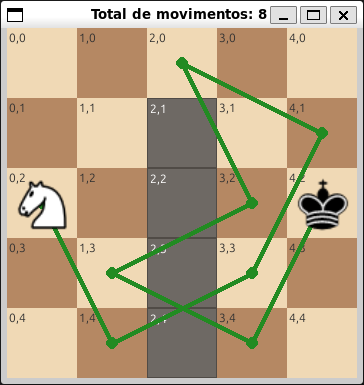

# Desafio Computacional
<div align="center">
        
        <p><em>Figura 1: Visualização do caminho encontrado</em></p>
</div>

## Como rodar

Passos:

1. Clonar o repositório:
     ```bash
     git clone https://github.com/seu-usuario/knight-robot-navigation.git
     cd knight-robot-navigation
     ```

2. Compilar:
    ```bash
    make
    ```
         
3. Rodar:
     ```bash
     ./knight
     ```
     O `main` atual chama `Reader::load("exemplo.txt")`, então certifique-se de ter um arquivo de entrada (`exemplo.txt`) no diretório ou modifique o código para apontar para outro arquivo.

4. Exibir plot/display com solução:
    ```bash
     source ./.venv/bin/activate
     python3 solution.py
     ```
     Lembrando que para funcionar é necessário que o arquivo `solucao.txt` precisa ter sido gerado.